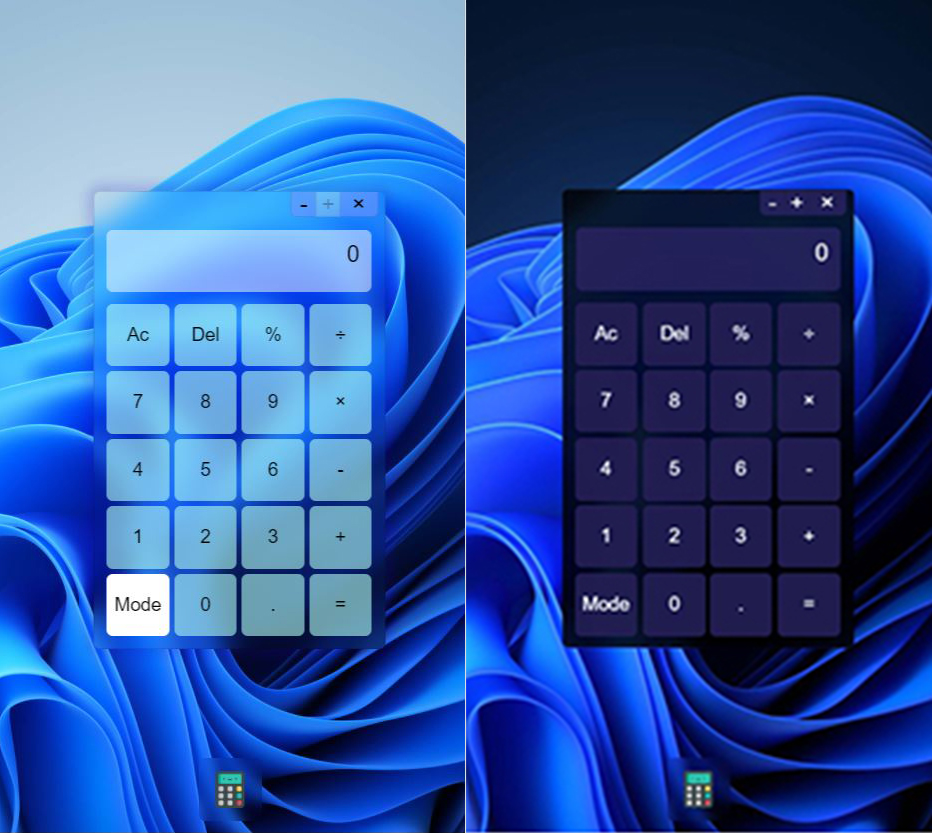

# Calculator-11-Style

Kalkulator ini merupakan penugasan dari pelatihan Fresh Graduade Academy - Front End Developer. Kalkulator ini dibuat menggunakan vanila HTML&CSS serta JavaScript. 

Fitur kalkulator :
- Kalkulator Basic
- Memiliki style windows 11.
- Memiliki tema gelap terang
- Fitur drag sehingga dapat digeset sesuai keinginan
- Memiliki dock yang dapat menampilkan dan menyembunyikan kalkulator.

Kalkualtor ini dapat dilihat pada laman dibawah ini :
- https://ahmadeko2017.github.io/Calculator-7-Style/
